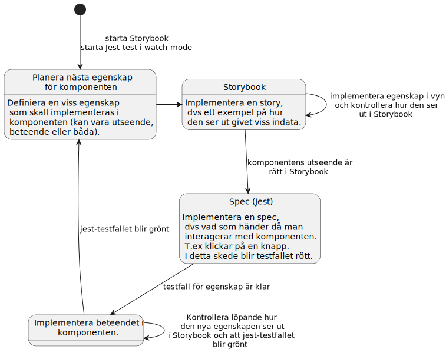
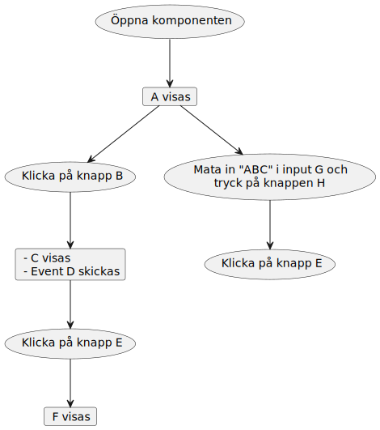
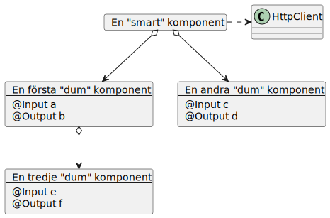
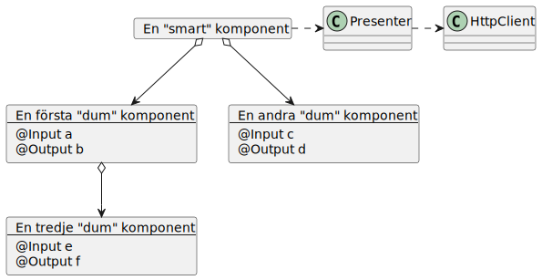

Test-driven Utveckling i frontend med Storybook, Jest och Testing Library
-------------------------------------------------------------------------
<!-- TOC -->
  * [Test-driven Utveckling i frontend med Storybook, Jest och Testing Library](#test-driven-utveckling-i-frontend-med-storybook-jest-och-testing-library)
  * [Process](#process)
  * [Testa komponentens utseende och statiska egenskaper med Storybook](#testa-komponentens-utseende-och-statiska-egenskaper-med-storybook)
    * [Storyshots](#storyshots)
  * [Testa komponentens beteende med Jest](#testa-komponentens-beteende-med-jest)
  * [Testa Service](#testa-service)
  * [TDD med Storybook och Jest](#tdd-med-storybook-och-jest)
  * [Storybook](#storybook)
    * [Recept för olika scenarior](#recept-fr-olika-scenarior)
      * [Hantera @Input och @Output](#hantera-input-och-output)
      * [Hur hantera beroenden till @Injectable:s](#hur-hantera-beroenden-till-injectable--s)
      * [Interactions](#interactions)
      * [Mocka HTTP-anrop](#mocka-http-anrop)
  * [Spec-test med Jest](#spec-test-med-jest)
    * [Struktur för ett test](#struktur-fr-ett-test)
      * [Iteration 1](#iteration-1)
      * [Iteration 2](#iteration-2)
    * [Mockning](#mockning)
      * [Observables](#observables)
      * [EventEmitter för @Output](#eventemitter-fr-output)
      * [Timers](#timers)
  * [Testing Library](#testing-library)
    * [Vanliga saker](#vanliga-saker)
      * [@Input och @Output till komponenten](#input-och-output-till-komponenten)
      * [@Injectable](#injectable)
      * [DOM API](#dom-api)
  * [Designmönster för komponenter](#designmnster-fr-komponenter)
    * [Dumma (presentation) vs smarta (container) komponenter](#dumma--presentation--vs-smarta--container--komponenter)
    * [Controller-logik i komponentspecifik service (presenter)](#controller-logik-i-komponentspecifik-service--presenter-)
<!-- TOC -->

Denna är en beskrivning för hur man kan utföra TDD i frontend. Den beskriver process, verktyg samt lite designmönster
för att göra komponenter mer testbara.

Följande verktyg beskrivs:

- [Storybook](https://storybook.js.org/): _Storybook is an open source tool for building UI components and pages in
  isolation. It streamlines UI development, testing, and documentation_
- [Jest](https://jestjs.io/): _Jest is a delightful JavaScript Testing Framework with a focus on simplicity_
- [Testing Library](https://testing-library.com/): _Simple and complete testing utilities that encourage good testing
  practices_

Process
-------
Vid utveckling

- Starta Storybook och ha öppet i browsern
- Starta jest-spec-filen och kör i watch-mode



Testa komponentens utseende och statiska egenskaper med Storybook
-----------------------------------------------------------------
När man utvecklar börjar man med att definiera utseende. Som stöd för detta används Storybook. I dess användargränssnitt
kan man se hur komponenten ser ut givet olika inputs.

Varje sådan set-up för komponenten kallas för en _story_.

T.ex kan man i en story visa hur en knapp ser ut om den är aktiv och i en annan hur den ser ut om den är deaktiverad.

Man kan även manipulera input, titta på actions och mycket mer med hjälp av _addons_. Det som tas upp här skrapar bara
på ytan.

### Storyshots
Om man använder [Storyshots](https://storybook.js.org/addons/@storybook/addon-storyshots) för snapshot-testning kommer
var och en av dessa stories bli ett testfall. Notera dock att detta endast är till för regressionstest. 

När man får ett regressionstestfel, så kommer man kunna se i felutskriften vad i HTML som diffar. 
Man kan även inspektera komponenten i Storybook och se om det är OK. Om allt är korrekt kan man sedan uppdatera sitt snapshot 
(se `test:update-snapshot` i [package.json](../package.json)). 

Testa komponentens beteende med Jest
------------------------------------
När vi sedan börjar utveckla beteendet, dvs vad skall komponenten göra när man interagerar med den (t.ex klickar på en
knapp)
implementerar vi testfall i _{component}.component.spec.ts_-filen.

För detta används Jest som testexekverare samt Testing Library för att komma åt samt manipulera element i vyn (DOM:en).

Testa Service
-------------
När man skall testa en Service är det bara som att testa vilken klass som helst. Man skapar objektet och skickar in
mockade beroenden i konstruktorn.

TDD med Storybook och Jest
--------------------------
Värt att tänka på när man implementerar en komponent är att sträva efter att implementera dem som "dumma" komponenter (
se nedan).

Detta förenklar testerna avsevärt.

Storybook
---------

### Recept för olika scenarior

#### Hantera @Input och @Output

I storybook är det förberett för att ange @Input och @Output på ett enkelt sätt med hjälp av s.k _Args_.

Se kodexempel: [../src/app/labs/1-input-output/input-output.component.stories.ts](../src/app/labs/1-input-output/input-output.component.stories.ts)

Se även [Storybook, Args](https://storybook.js.org/docs/angular/writing-stories/args)
för mer info.

#### Hur hantera beroenden till @Injectable:s

Om komponenten har beroenden till @Injectable:s, t.ex en service kan man injicera in mockade varianter av
@Injectable-objektet med hjälp av s.k _Decorator_:s.

Se körbart kodexempel i [../src/app/labs/2-injectables/injectables.component.stories.ts](../src/app/labs/2-injectables/injectables.component.stories.ts).

Se [Storybook, Decorators](https://storybook.js.org/docs/angular/writing-stories/decorators#story-decorators)
för mer info.

#### Interactions
Ibland kan man behöva interagera med komponenten för att nå ett visst tillstånd som skall visas i en story.

Då kan man använda s.k _interactions_.

Exempel på detta finns i [../src/app/labs/3-message-button/message-button.component.stories.ts](../src/app/labs/3-message-button/message-button.component.stories.ts).

#### Mocka HTTP-anrop
Enklast är att helt enkelt mocka Angulars HttpClient.

(Det finns även en Storybook-addon [Mock Service Worker](https://storybook.js.org/addons/msw-storybook-addon), vilken kan användas för att mocka HTTP-anrop, men den känns överflödig.)

Se kodexempel [../src/app/labs/4-http/http.component.stories.ts](../src/app/labs/4-http/http.component.stories.ts).

Spec-test med Jest
------------------

### Struktur för ett test

Bygg struktur utefter olika flöden, t.ex:



osv...


Detta kan sedan omsättas i en spec-struktur:

Se även körbart kodexempel [../src/app/labs/5-test-structure/test-structure.component.spec.ts](../src/app/labs/5-test-structure/test-structure.component.spec.ts).

```typescript
describe('TestStructureComponent', () => {
  describe('when the component has opened', () => {
    it('should show A', () => {
      // Assertion
    })
    describe('when clicking button B', () => {
      it('should show C', () => {
        // Assertion
      })
      it('should send the event D', () => {
        // Assertion
      })
      describe('when clicking the button E', () => {
        it('should show F', () => {
          // Assertion
        })
      })
    })
    describe('when entering "ABC" into input G and then click the H button', () => {
      it('should send the event I with "ABC"', () => {
        // Assertion
      })
    })
  })
})
```

Om man skulle implementera detta med TDD skulle man köra ett antal iterationer enligt processen ovan.

#### Iteration 1

Implementera visning av A.

```typescript
import { render, RenderResult } from "@testing-library/angular";
import { screen } from "@testing-library/dom";
import { TestStructureComponent } from "./my-component.component";

describe('TestStructureComponent', () => {
  describe('when the component has opened', () => {
    let tree: RenderResult<TestStructureComponent, TestStructureComponent>;
    beforeEach(async () => {
      tree = await render(TestStructureComponent);
    })
    it('should show A', () => {
      expect(screen.getByText('A')).toBeDefined()
    })
  })
})
```

#### Iteration 2

Implementera hantering av knapp B.

```typescript
import { EventEmitter } from "@angular/core";
import { render, RenderResult } from "@testing-library/angular";
import { fireEvent, screen } from "@testing-library/dom";
import { TestStructureComponent } from "./my-component.component";

describe('TestStructureComponent', () => {
  describe('when the component has opened', () => {
    const dOutputMockEmit = jest.fn()
    const dOutputMock = {
      emit: dOutputMockEmit
    } as unknown as EventEmitter<void>
    let tree: RenderResult<TestStructureComponent, TestStructureComponent>;
    beforeEach(async () => {
      tree = await render(MyComponent, {
        componentProperties: {
          dOutput: dOutputMock // Behövs för iteratiopn 2
        }
      });
    })
    it('should show A', () => {
      expect(screen.getByText('A')).toBe()
    })

    // Här bygger vi på med Iteration 2 beteende
    describe('when clicking button B', () => {
      beforeEach(() => {
        fireEvent.click(screen.getByText('B', {selector: 'button'}))
      });
      it('should show C', () => {
        screen.getByText('C', {selector: 'p.message'})
      })
      it('should send the event D', () => {
        expect(dOutputMock.emit).toHaveBeenCalled()
      })
    })
  })
})
```

Bygg på med ytterligare beteende i fler iterationer.

### Mockning

När man implementerar `.spec.ts`-filer med Jest så är det enkelt att implementera mock-objekt och mock-funktioner.

Nedan finns några exempel på mockningar som kan behövas i Angular-komponenter.

#### Observables

När komponenten är observer på en observable kan man göra på lite olika sätt, men mest rakt på är att skapa ett
RxJS `Subject` för den observable man vill
(typiskt som en del av en mockad service).

Sedan kan man i testfallen stoppa in värden via `Subject.next()`.

Ett annat alternativ är att stoppa in en observable med fasta värden, dvs en `of()`
(vilken kan importeras med `import {of as observableOf} from 'rxjs'` för att få lite tydligare namn).

Exempel finns i [../src/app/labs/6-observable/observable.component.spec.ts](../src/app/labs/6-observable/observable.component.spec.ts).

#### EventEmitter för @Output

Sätt upp koppling mellan en funktionsmock och den `componentProperty`, som är @Output.

Exempel på detta finns i [../src/app/labs/1-input-output/input-output.component.spec.ts](../src/app/labs/1-input-output/input-output.component.spec.ts)
där _@Output_:en `myOutput` mappas till mocken `myOutputMock`.

#### Timers

Jest har stöd för fejkade timers så att man kan styra tiden, vilket är användbart när man använder `setTimeout()` i sin
kod.

Se exempel [../src/app/labs/7-timers/delayed.component.spec.ts](../src/app/labs/7-timers/delayed.component.spec.ts).

Läs mer på [Jest, Timer mocks](https://jestjs.io/docs/26.x/timer-mocks)

Testing Library
---------------

### Vanliga saker

#### @Input och @Output till komponenten

Detta sätts upp i `render`-funktionen som skapar upp komponenten.

```typescript
  :
let tree: RenderResult<MyComponent, MyComponent>
beforeEach(async () => {
  tree = render(MyComponent, {
    componentProperties: {
      // Mocka en EventEmitter och stoppa in i det 
      // @Output()-annoterade fältet MyComponent.myOutput  
      myOutput: dOutputMock,
      // Stoppa in värdet på det @Input()-annoterade 
      // fältet MyComponent.myInput
      myInput: '42'
    }
  })
})
:
```

#### @Injectable

@Injectable-objekt sätts upp i `render`-funktionen som skapar upp komponenten på samma sätt som i deklarationen för
Angular-modul

```typescript
  :
let tree: RenderResult<MyComponent, MyComponent>
beforeEach(async () => {
  tree = render(MyComponent, {
    providers: [
      {
        provide: MyService, // ange klassnamn för @Injectable-annoterad klass
        useValue: myServiceMock // tilldela mockobjekt
      }
    ]
  })
})
:
```

#### DOM API

Testing library har ett rikt API för att göra frågor samt trigga event i DOM:en.

Se [Testing Library, CoreAPI](https://testing-library.com/docs/queries/about).

Designmönster för komponenter
-----------------------------
När man designar eller refaktoriserar komponenter kan följande designmönster vara värda att fundera på.

Här finns en bra översikt [Model-View-Presenter with Angular Series' Articles](https://dev.to/layzee/series/9847).

### Dumma (presentation) vs smarta (container) komponenter

Dumma komponenter är komponenter som helt saknar tillstånd och som enbart kommunicerar med omgivningen via `@Input`
/`@Output`. Alltså inga tjänster (=`@Injectable`-objekt). Sådana komponenter är enkla att återanvända, testa och
resonera kring.

Sedan har vi komponenter som har ett internt tillstånd men fortfarande enbart kommunicerar med omgivningen via `@Input`
/`@Output`. Dessa är fortfarande ganska enkla och kan i princip klassas som "dumma".

En komponent som använder en, eller fler tjänster, börjar glida över i facket "smarta" komponenter. De är svårare att
återanvända och testa eftersom de har beroenden till andra artefakter.

Till sist har vi riktiga "smarta" komponenter, eller _container_-komponenter. De har beroenden till tjänster (typiskt
för åtkomst till backend) och har dessutom en understruktur av andra (förhoppningsvis bara "dumma") komponenter som de
koordinerar.

Man kan här sträva efter att implementera

- "dumma" (ev. med tillstånd) komponenter för presentation.
  (Utnyttja `changeDetection: ChangeDetectionStrategy.OnPush` i dessa.)
- "smarta" komponenter för allt som kräver åtkomst till tjänster och koordinering. De kan typiskt vara komponenter som
  inkluderas via routing.

Exempel:



Se kod i [../src/app/labs/8-component-with-structure](../src/app/labs/8-component-with-structure).

### Controller-logik i komponentspecifik service (presenter)

Om en "smart" komponent börjar få riktigt mycket logik kan det underlätta att flytta logiken till en komponentlokal
tjänst som injiceras in i komponenten. Detta underlättar bl.a testning, då testfallen för all logik istället berör en
vanlig Typescript-klass.



Se kod i [../src/app/labs/9-component-with-presenter](../src/app/labs/9-component-with-presenter).

